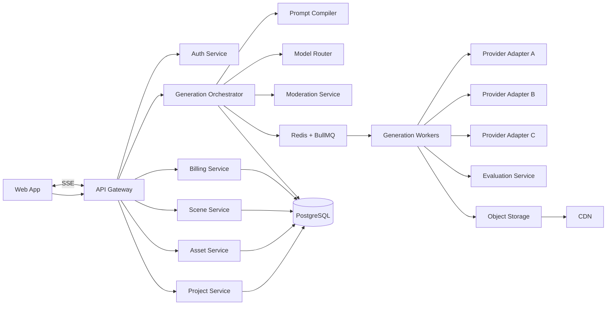
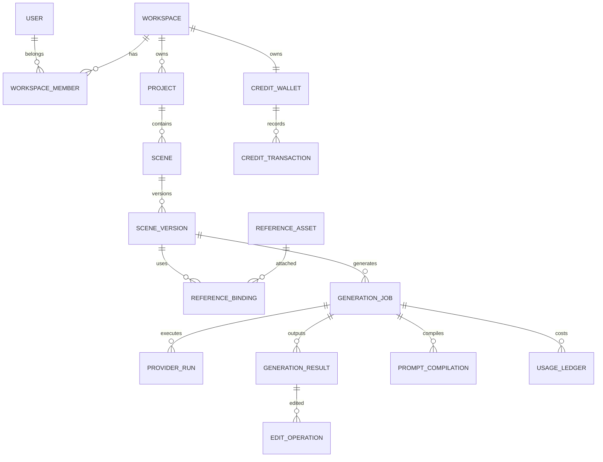
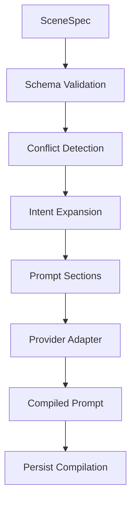
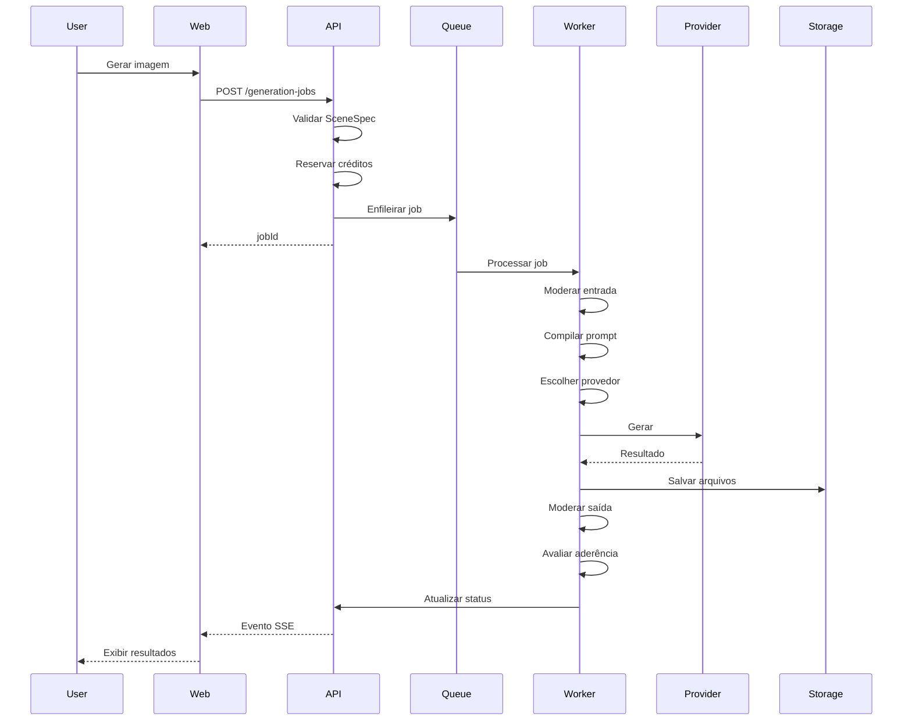

# Blueprint completo — Plataforma de geração e edição de imagens com IA

> Documento de arquitetura, especificação funcional e prompt mestre para desenvolvimento com Claude Code.

---

## 1. Visão do produto

Construir uma plataforma web de geração e edição de imagens com IA orientada a **cenas**, **referências visuais** e **intenção criativa**.

A plataforma não deve ser apenas um formulário extenso para montar prompts. O usuário deve atuar como diretor criativo, enquanto o sistema converte suas escolhas em uma especificação estruturada, valida conflitos, escolhe o provedor adequado, gera variações e mantém histórico completo.

### Proposta de valor

- Geração de imagens por linguagem natural.
- Controles visuais guiados para composição, pose, câmera, iluminação e estilo.
- Uso de múltiplas referências, cada uma com função explícita.
- Edição localizada por máscara.
- Histórico versionado.
- Travas de identidade, roupa, fundo, pose, composição e paleta.
- Geração em rascunho antes da renderização final.
- Suporte a múltiplos provedores de IA.
- Controle de créditos, custos e limites.
- Base preparada para campanhas, brand kits e colaboração.

---

## 2. Princípios de produto

1. **Intenção antes de parâmetros**  
   O usuário descreve o resultado desejado; o sistema deriva a configuração técnica.

2. **Complexidade progressiva**  
   Usuários iniciantes veem poucos controles. Usuários avançados podem abrir parâmetros profissionais.

3. **Cena estruturada, não apenas prompt**  
   A fonte da verdade é um objeto `SceneSpec`, e não uma string de prompt.

4. **Edição sem destruição**  
   Toda alteração cria uma nova versão.

5. **Provedor intercambiável**  
   A interface e o domínio não dependem de uma API específica.

6. **Rascunho antes da alta qualidade**  
   Reduzir custo e tempo durante exploração.

7. **Transparência operacional**  
   Exibir custo estimado, provedor, status, referências e parâmetros usados.

8. **Privacidade e segurança por padrão**  
   Uploads protegidos, URLs assinadas, exclusão configurável e moderação em múltiplas etapas.

---

## 3. Perfis de uso

### 3.1 Modo rápido

O usuário fornece:

- descrição da imagem;
- proporção;
- referências opcionais;
- finalidade da peça.

O sistema propõe uma cena completa e gera rascunhos.

### 3.2 Modo guiado

O sistema conduz o usuário por etapas:

1. finalidade;
2. sujeito principal;
3. cenário;
4. composição;
5. câmera;
6. iluminação;
7. estilo;
8. saída.

### 3.3 Modo profissional

Libera:

- pesos das referências;
- força de identidade;
- lente simulada;
- profundidade de campo;
- parâmetros específicos do provedor;
- seed, quando suportado;
- negative prompt, quando suportado;
- configurações de qualidade;
- roteamento manual de modelo.

---

## 4. Escopo do MVP

### Incluído

- autenticação;
- workspaces;
- projetos;
- cenas;
- versões de cena;
- upload de referências;
- atribuição de função para cada referência;
- editor visual;
- `SceneSpec` versionado;
- geração por texto;
- geração com referências;
- quatro rascunhos por job;
- seleção e refinamento;
- edição localizada por máscara;
- histórico de versões;
- dois provedores de imagem;
- sistema de créditos;
- moderação;
- exportação;
- logs e observabilidade;
- painel administrativo básico.

### Fora do MVP

- colaboração em tempo real;
- marketplace de estilos;
- vídeo;
- treinamento de modelos próprios;
- aplicação mobile nativa;
- edição vetorial completa;
- cobrança complexa por marketplace;
- API pública para terceiros.

---

## 5. Arquitetura de experiência

## 5.1 Layout principal

### Barra superior

- projeto atual;
- seletor de modo;
- status de salvamento;
- créditos disponíveis;
- custo estimado;
- histórico;
- exportar;
- gerar.

### Painel esquerdo — Biblioteca do projeto

- referências do sujeito;
- rosto;
- corpo;
- roupa;
- produto;
- cenário;
- estilo;
- pose;
- paleta;
- logotipo;
- brand kit.

Cada referência deve possuir:

- miniatura;
- tipo;
- função;
- peso;
- instrução de preservação;
- permissões de uso;
- status de processamento.

### Área central — Canvas

- preview da cena;
- grade de resultados;
- comparação lado a lado;
- seleção de versão;
- zoom;
- pan;
- criação de máscara;
- edição por região;
- before/after;
- indicação de áreas bloqueadas.

### Painel direito — Inspetor contextual

O conteúdo muda conforme o item selecionado.

#### Sujeito

- descrição;
- identidade;
- expressão;
- pose;
- roupa;
- posição;
- direção do olhar;
- consistência.

#### Cenário

- ambiente;
- horário;
- clima;
- profundidade;
- elementos;
- densidade visual;
- fundo limpo ou detalhado.

#### Câmera

- enquadramento;
- ângulo;
- lente simulada;
- distância;
- profundidade de campo;
- movimento;
- orientação.

#### Iluminação

- key light;
- fill light;
- rim light;
- contraste;
- temperatura;
- direção;
- dureza;
- atmosfera.

#### Composição

- posição do sujeito;
- espaço negativo;
- regra dos terços;
- direção do olhar;
- área reservada para texto;
- equilíbrio visual.

#### Saída

- proporção;
- resolução;
- quantidade;
- modo rascunho ou final;
- formato;
- transparência, quando suportada.

### Linha do tempo inferior

Exemplo:

```text
Brief → Cena inicial → Rascunho A → Variação A2 → Edição de roupa → Final
```

---

## 6. Arquitetura técnica

## 6.1 Visão macro



---

## 6.2 Stack recomendada

### Monorepo

- `pnpm`
- Turborepo
- TypeScript estrito

### Frontend

- Next.js com App Router;
- React;
- TypeScript;
- Tailwind CSS;
- shadcn/ui;
- Zustand para estado local;
- TanStack Query para estado remoto;
- React Hook Form;
- Zod;
- Konva.js para canvas, máscaras e overlays;
- SSE para progresso dos jobs.

### Backend

- NestJS;
- Fastify adapter;
- Prisma ORM;
- PostgreSQL;
- Redis;
- BullMQ;
- OpenAPI;
- Zod ou class-validator nas bordas;
- Pino para logs.

### Infraestrutura

- PostgreSQL gerenciado;
- Redis gerenciado;
- armazenamento compatível com S3;
- CDN;
- containerização com Docker;
- deploy do frontend e API de forma independente;
- workers escaláveis horizontalmente.

### Observabilidade

- OpenTelemetry;
- Sentry;
- métricas Prometheus ou serviço equivalente;
- tracing por `requestId`, `jobId` e `generationId`.

---

## 7. Estrutura do repositório

```text
apps/
  web/
    app/
    components/
    features/
    hooks/
    lib/
    stores/
    styles/
    tests/

  api/
    src/
      modules/
        auth/
        users/
        workspaces/
        projects/
        scenes/
        assets/
        generations/
        providers/
        billing/
        moderation/
        exports/
        admin/
      common/
      config/
      main.ts

  worker-generation/
    src/
      processors/
      providers/
      evaluation/
      moderation/
      storage/
      main.ts

packages/
  ui/
  config-eslint/
  config-typescript/
  domain/
  scene-spec/
  prompt-compiler/
  provider-sdk/
  database/
  observability/
  testing/

infra/
  docker/
  terraform/
  scripts/

docs/
  architecture/
  adr/
  api/
  product/
```

---

## 8. Domínio principal

## 8.1 Entidades

```text
User
Workspace
WorkspaceMember
Project
Scene
SceneVersion
ReferenceAsset
ReferenceBinding
GenerationJob
GenerationResult
ProviderRun
PromptCompilation
EditOperation
MaskAsset
BrandKit
CreditWallet
CreditTransaction
UsageLedger
ModerationDecision
ConsentRecord
ExportJob
AuditLog
```

---

## 8.2 Relacionamentos



---

## 9. SceneSpec

O `SceneSpec` é a fonte da verdade da cena.

### 9.1 Exemplo

```json
{
  "version": "1.0",
  "intent": {
    "purpose": "social_media_campaign",
    "message": "autoridade e confiança",
    "targetAudience": "adultos interessados em terapia",
    "textPlacement": "left"
  },
  "subject": {
    "type": "person",
    "description": "psicanalista experiente",
    "identityLock": 0.9,
    "pose": "arms_crossed",
    "expression": "confident_calm",
    "gaze": "camera",
    "position": "right",
    "wardrobe": {
      "description": "terno escuro elegante",
      "lock": true
    }
  },
  "scene": {
    "location": "consultório contemporâneo",
    "time": "evening",
    "weather": null,
    "backgroundDetail": "medium",
    "props": ["livros", "luminária", "poltrona"]
  },
  "camera": {
    "shot": "waist_up",
    "angle": "eye_level",
    "lensMm": 50,
    "depthOfField": "shallow",
    "orientation": "landscape"
  },
  "lighting": {
    "key": "soft",
    "fill": "subtle",
    "rim": true,
    "contrast": "cinematic",
    "temperature": "warm_neutral"
  },
  "composition": {
    "rule": "thirds",
    "subjectPosition": "right",
    "negativeSpace": "left",
    "reservedTextArea": true,
    "symmetry": false
  },
  "style": {
    "preset": "cinematic_editorial",
    "realism": 0.9,
    "stylization": 0.35,
    "palette": ["#A90045", "#163F46", "#EFE8D6"]
  },
  "references": [
    {
      "assetId": "ref_face_01",
      "role": "identity",
      "weight": 0.95,
      "preserve": ["face", "skin_tone"]
    },
    {
      "assetId": "ref_style_02",
      "role": "style",
      "weight": 0.45,
      "preserve": ["lighting", "palette"]
    }
  ],
  "locks": {
    "identity": true,
    "wardrobe": true,
    "pose": false,
    "camera": true,
    "background": false,
    "palette": true
  },
  "output": {
    "aspectRatio": "16:9",
    "quality": "draft",
    "count": 4,
    "format": "webp",
    "transparentBackground": false
  },
  "advanced": {
    "provider": "auto",
    "seed": null,
    "negativePrompt": null,
    "providerParams": {}
  }
}
```

---

## 9.2 Validação do SceneSpec

Criar validações para:

- proporção incompatível com transparência;
- plano muito aberto com exigência de detalhes faciais;
- espaço negativo conflitante com posição do sujeito;
- múltiplas referências de identidade com pesos altos;
- trava de roupa sem referência de roupa;
- uso de máscara sem imagem base;
- resolução não suportada pelo provedor;
- quantidade acima do plano do usuário;
- campos profissionais não suportados pelo provedor.

As validações devem possuir três níveis:

- `error`: impede o job;
- `warning`: pede confirmação;
- `suggestion`: oferece otimização automática.

---

## 10. Prompt Compiler

## 10.1 Responsabilidades

- converter `SceneSpec` em prompt textual;
- gerar negative prompt quando aplicável;
- priorizar informações;
- remover redundâncias;
- detectar conflitos;
- adaptar sintaxe por provedor;
- anexar instruções de referência;
- gerar resumo legível para o usuário;
- registrar versão do compilador.

## 10.2 Pipeline



## 10.3 Seções do prompt

Ordem recomendada:

1. intenção e tipo de imagem;
2. sujeito;
3. pose e expressão;
4. cenário;
5. composição;
6. câmera;
7. iluminação;
8. direção de arte;
9. restrições;
10. requisitos de saída.

## 10.4 Interface

```ts
export interface PromptCompiler {
  compile(input: {
    sceneSpec: SceneSpec;
    providerCapabilities: ProviderCapabilities;
    mode: 'draft' | 'final' | 'edit';
  }): Promise<PromptCompilationResult>;
}

export interface PromptCompilationResult {
  prompt: string;
  negativePrompt?: string;
  referenceInstructions: ReferenceInstruction[];
  warnings: CompilationWarning[];
  normalizedSceneSpec: SceneSpec;
  compilerVersion: string;
}
```

---

## 11. Abstração de provedores

## 11.1 Contrato principal

```ts
export interface ImageProvider {
  readonly id: string;

  getCapabilities(): ProviderCapabilities;

  estimateCost(request: ProviderGenerationRequest): Promise<ProviderCostEstimate>;

  generate(request: ProviderGenerationRequest): Promise<ProviderJobHandle>;

  edit(request: ProviderEditRequest): Promise<ProviderJobHandle>;

  getStatus(jobId: string): Promise<ProviderJobStatus>;

  cancel(jobId: string): Promise<void>;
}
```

## 11.2 Capabilities

```ts
export interface ProviderCapabilities {
  textToImage: boolean;
  imageToImage: boolean;
  maskedEdit: boolean;
  multipleReferences: boolean;
  transparentBackground: boolean;
  seed: boolean;
  negativePrompt: boolean;
  partialStreaming: boolean;
  supportedAspectRatios: string[];
  maxReferenceImages: number;
  maxOutputs: number;
}
```

## 11.3 Roteamento automático

O `ModelRouter` deve considerar:

- tipo de operação;
- quantidade de referências;
- presença de máscara;
- necessidade de identidade consistente;
- resolução;
- velocidade;
- custo;
- taxa de erro recente;
- disponibilidade;
- plano do usuário;
- política de fallback.

### Exemplo de scoring

```text
score = capabilityMatch * 0.35
      + qualityScore * 0.25
      + costScore * 0.15
      + latencyScore * 0.10
      + reliabilityScore * 0.15
```

---

## 12. Orquestração de geração

## 12.1 Estados do job

```text
DRAFT
QUEUED
VALIDATING
MODERATING_INPUT
COMPILING
ROUTING
SUBMITTING
PROCESSING
DOWNLOADING
MODERATING_OUTPUT
EVALUATING
COMPLETED
FAILED
CANCELLED
```

## 12.2 Fluxo



---

## 13. API HTTP

## 13.1 Autenticação

```text
POST   /auth/register
POST   /auth/login
POST   /auth/logout
POST   /auth/refresh
GET    /auth/me
```

## 13.2 Workspaces

```text
GET    /workspaces
POST   /workspaces
GET    /workspaces/:workspaceId
PATCH  /workspaces/:workspaceId
GET    /workspaces/:workspaceId/members
POST   /workspaces/:workspaceId/members
DELETE /workspaces/:workspaceId/members/:memberId
```

## 13.3 Projetos

```text
GET    /projects
POST   /projects
GET    /projects/:projectId
PATCH  /projects/:projectId
DELETE /projects/:projectId
```

## 13.4 Cenas

```text
GET    /projects/:projectId/scenes
POST   /projects/:projectId/scenes
GET    /scenes/:sceneId
PATCH  /scenes/:sceneId
DELETE /scenes/:sceneId
POST   /scenes/:sceneId/versions
GET    /scenes/:sceneId/versions
GET    /scene-versions/:versionId
POST   /scene-versions/:versionId/duplicate
```

## 13.5 Assets

```text
POST   /assets/upload-url
POST   /assets/complete
GET    /assets/:assetId
PATCH  /assets/:assetId
DELETE /assets/:assetId
POST   /assets/:assetId/analyze
```

## 13.6 Geração

```text
POST   /generation-jobs
GET    /generation-jobs/:jobId
POST   /generation-jobs/:jobId/cancel
POST   /generation-jobs/:jobId/retry
GET    /generation-jobs/:jobId/events
GET    /generation-results/:resultId
POST   /generation-results/:resultId/refine
POST   /generation-results/:resultId/variation
POST   /generation-results/:resultId/edit
```

## 13.7 Billing e créditos

```text
GET    /billing/wallet
GET    /billing/transactions
GET    /billing/usage
POST   /billing/estimate
```

## 13.8 Exportação

```text
POST   /exports
GET    /exports/:exportId
GET    /exports/:exportId/download
```

---

## 14. Banco de dados

## 14.1 Regras gerais

- UUIDs;
- timestamps UTC;
- soft delete em projetos, cenas e assets;
- `workspaceId` em todas as entidades multi-tenant;
- índices por status, owner, createdAt e foreign keys;
- JSONB para `SceneSpec` e parâmetros de provedor;
- nunca armazenar segredos de provedores no banco sem criptografia;
- idempotency key nos jobs.

## 14.2 Tabelas essenciais

### `scene_versions`

```text
id
scene_id
version_number
scene_spec_json
created_by
created_at
parent_version_id
change_summary
```

### `generation_jobs`

```text
id
workspace_id
project_id
scene_id
scene_version_id
status
operation_type
requested_count
provider_strategy
selected_provider
estimated_credits
reserved_credits
actual_credits
idempotency_key
error_code
error_message
created_at
started_at
completed_at
```

### `generation_results`

```text
id
generation_job_id
provider_run_id
asset_id
thumbnail_asset_id
width
height
format
seed
safety_status
evaluation_json
selected
created_at
```

### `provider_runs`

```text
id
generation_job_id
provider
provider_model
provider_job_id
request_json
response_json
cost_external
latency_ms
status
created_at
```

---

## 15. Sistema de créditos

## 15.1 Regras

1. estimar custo antes da execução;
2. reservar créditos ao criar o job;
3. confirmar débito após sucesso;
4. devolver reserva em falha não imputável ao usuário;
5. registrar custo interno e custo do provedor;
6. impedir saldo negativo;
7. garantir idempotência transacional.

## 15.2 Ledger

Nunca atualizar apenas um campo de saldo sem registrar transação.

Tipos:

```text
PURCHASE
BONUS
RESERVATION
CAPTURE
RELEASE
REFUND
ADMIN_ADJUSTMENT
```

---

## 16. Uploads e armazenamento

### Processo

1. frontend solicita URL assinada;
2. frontend envia diretamente ao object storage;
3. frontend confirma upload;
4. backend valida MIME, tamanho e hash;
5. worker gera miniatura;
6. worker analisa o asset;
7. asset recebe status `READY`.

### Estrutura sugerida

```text
workspaces/{workspaceId}/projects/{projectId}/assets/{assetId}/original.webp
workspaces/{workspaceId}/projects/{projectId}/assets/{assetId}/thumb.webp
workspaces/{workspaceId}/projects/{projectId}/masks/{maskId}.png
workspaces/{workspaceId}/projects/{projectId}/exports/{exportId}.png
```

### Segurança

- bucket privado;
- URLs assinadas com expiração curta;
- validação de tipo real do arquivo;
- limite de tamanho;
- varredura de malware;
- remoção de metadados sensíveis;
- política de retenção.

---

## 17. Moderação e consentimento

## 17.1 Pontos de moderação

- texto enviado;
- imagens de referência;
- máscaras;
- prompt compilado;
- imagem final;
- exportação.

## 17.2 Consentimento

Quando houver pessoas reais:

- solicitar confirmação de autorização;
- registrar consentimento;
- permitir revogação e exclusão;
- limitar transformações sensíveis;
- manter trilha de auditoria.

## 17.3 Decisões

```text
ALLOW
ALLOW_WITH_WARNING
REVIEW_REQUIRED
BLOCK
```

---

## 18. Avaliação automática do resultado

Após a geração, executar uma análise visual para medir:

- aderência ao sujeito;
- consistência de identidade;
- correspondência com composição;
- fidelidade à paleta;
- preservação de elementos bloqueados;
- existência de espaço para texto;
- defeitos visuais evidentes;
- correspondência com o objetivo.

### Exemplo

```json
{
  "identityConsistency": 0.88,
  "compositionMatch": 0.94,
  "paletteMatch": 0.81,
  "reservedTextAreaPresent": true,
  "locksRespected": {
    "identity": true,
    "wardrobe": true,
    "camera": true
  },
  "issues": [
    {
      "code": "WEAK_RIM_LIGHT",
      "severity": "low",
      "message": "A luz de recorte ficou abaixo do solicitado."
    }
  ]
}
```

---

## 19. Edição localizada

### Recursos

- pintar máscara;
- apagar máscara;
- inverter seleção;
- feather;
- expandir ou contrair máscara;
- editar apenas seleção;
- preservar restante da imagem;
- usar prompt de edição;
- criar nova versão.

### Fluxo

```text
Resultado selecionado
→ Criar máscara
→ Descrever alteração
→ Gerar prévia
→ Comparar
→ Confirmar como nova versão
```

---

## 20. Sistema de travas

```ts
export interface SceneLocks {
  identity: boolean;
  face: boolean;
  hairstyle: boolean;
  wardrobe: boolean;
  pose: boolean;
  camera: boolean;
  composition: boolean;
  background: boolean;
  palette: boolean;
  product: boolean;
}
```

O compilador e o provedor devem respeitar essas travas. Quando um provedor não oferecer precisão suficiente, o sistema deve:

1. avisar o usuário;
2. sugerir outro provedor;
3. reduzir a promessa de consistência;
4. impedir a geração quando a trava for obrigatória.

---

## 21. Brand Kit

### Dados

- nome;
- logotipos;
- cores;
- fontes;
- estilos visuais;
- exemplos aprovados;
- termos proibidos;
- regras de composição;
- tom visual;
- produto principal;
- pessoas autorizadas.

### Aplicação

Ao selecionar um brand kit:

- preencher paleta;
- sugerir estilo;
- anexar regras ao compilador;
- validar consistência;
- impedir usos proibidos;
- habilitar templates de campanha.

---

## 22. UX de geração

### Antes de gerar

Exibir:

- resumo da cena;
- provedor previsto;
- quantidade de imagens;
- qualidade;
- custo estimado;
- tempo aproximado;
- alertas;
- elementos bloqueados.

### Durante

Exibir:

- status atual;
- progresso;
- miniaturas parciais, quando disponíveis;
- opção de cancelar;
- atualização por SSE.

### Depois

Exibir:

- grade de resultados;
- score de aderência;
- problemas detectados;
- ações rápidas;
- selecionar melhor resultado;
- refinar;
- variar;
- editar;
- exportar.

---

## 23. Estado do frontend

Separar claramente:

### Estado remoto

- projetos;
- cenas;
- versões;
- jobs;
- resultados;
- créditos.

Usar TanStack Query.

### Estado local do editor

- item selecionado;
- zoom;
- ferramenta ativa;
- máscara em edição;
- alterações ainda não persistidas;
- painel aberto;
- modo atual.

Usar Zustand.

### Estado persistente da cena

Sempre salvo como nova versão ou autosave controlado.

---

## 24. Autosave

### Estratégia

- debounce de 800 ms;
- salvar apenas mudanças válidas;
- usar `revision` otimista;
- detectar conflitos;
- mostrar status `salvando`, `salvo`, `erro`;
- criar snapshot explícito antes de gerar.

---

## 25. Segurança de aplicação

- RBAC por workspace;
- isolamento multi-tenant;
- rate limiting;
- CSRF quando aplicável;
- CSP;
- validação de entrada;
- escaping de saída;
- URLs assinadas;
- criptografia de segredos;
- rotação de chaves;
- logs sem dados sensíveis;
- auditoria de ações administrativas;
- proteção contra replay em webhooks;
- idempotência em geração e cobrança;
- princípio de menor privilégio.

---

## 26. Estratégia de testes

## 26.1 Unitários

- validadores do `SceneSpec`;
- compilador de prompt;
- roteador de modelos;
- cálculo de créditos;
- máquinas de estado;
- permissões.

## 26.2 Integração

- criação de projetos;
- upload de assets;
- criação de jobs;
- reserva e captura de créditos;
- fluxo do worker;
- fallback de provedor;
- cancelamento;
- retries.

## 26.3 Contrato

- adapters de provedores;
- schema das respostas;
- webhooks;
- capabilities.

## 26.4 End-to-end

- cadastro;
- criação de projeto;
- criação de cena;
- upload de referência;
- geração;
- seleção;
- edição;
- exportação.

## 26.5 Testes visuais

- layout do editor;
- responsividade;
- estados vazios;
- estados de erro;
- comparação de versões.

---

## 27. CI/CD

Pipeline mínimo:

```text
install
→ lint
→ typecheck
→ unit tests
→ integration tests
→ build
→ migrations check
→ container scan
→ deploy preview
→ smoke tests
→ production approval
```

### Regras

- migrations revisadas;
- nenhuma chave em código;
- cobertura mínima para domínio crítico;
- bloqueio em falha de typecheck;
- preview por pull request;
- rollback documentado.

---

## 28. Variáveis de ambiente

```bash
# App
NODE_ENV=
APP_URL=
API_URL=

# Database
DATABASE_URL=

# Redis
REDIS_URL=

# Storage
S3_ENDPOINT=
S3_REGION=
S3_BUCKET=
S3_ACCESS_KEY_ID=
S3_SECRET_ACCESS_KEY=
S3_PUBLIC_BASE_URL=

# Auth
AUTH_SECRET=
JWT_ACCESS_SECRET=
JWT_REFRESH_SECRET=

# Providers
IMAGE_PROVIDER_A_API_KEY=
IMAGE_PROVIDER_B_API_KEY=

# Observability
SENTRY_DSN=
OTEL_EXPORTER_OTLP_ENDPOINT=

# Feature flags
FEATURE_PROVIDER_ROUTING=true
FEATURE_MASK_EDITING=true
FEATURE_BRAND_KIT=false
```

---

## 29. Roadmap de implementação

## Fase 0 — Fundação

- criar monorepo;
- configurar lint, format e TypeScript;
- configurar Docker local;
- configurar PostgreSQL e Redis;
- configurar CI;
- criar documentação de arquitetura.

## Fase 1 — Autenticação e tenancy

- usuários;
- workspaces;
- membros;
- permissões;
- projetos;
- auditoria básica.

## Fase 2 — SceneSpec e editor básico

- schema compartilhado;
- validação;
- criação de cenas;
- versionamento;
- autosave;
- painel de propriedades.

## Fase 3 — Assets

- upload assinado;
- biblioteca;
- análise de referência;
- vínculo com cena;
- miniaturas;
- exclusão.

## Fase 4 — Geração

- jobs;
- filas;
- workers;
- prompt compiler;
- primeiro provider adapter;
- status por SSE;
- resultados.

## Fase 5 — Créditos e resiliência

- wallet;
- ledger;
- reserva;
- captura;
- refunds;
- retries;
- idempotência;
- fallback.

## Fase 6 — Segundo provedor e roteamento

- capabilities;
- model router;
- estimativa comparativa;
- fallback automático;
- painel de execução.

## Fase 7 — Edição e refinamento

- canvas;
- máscaras;
- edição localizada;
- variações;
- comparação;
- novas versões.

## Fase 8 — Segurança e moderação

- input moderation;
- output moderation;
- consentimento;
- retenção;
- auditoria;
- painel administrativo.

## Fase 9 — Polimento

- acessibilidade;
- performance;
- onboarding;
- templates;
- exportação;
- métricas de produto.

---

## 30. Métricas de produto

- tempo até primeira geração;
- taxa de conclusão de geração;
- custo médio por imagem aceita;
- quantidade média de tentativas;
- taxa de seleção de um resultado;
- taxa de edição pós-geração;
- falhas por provedor;
- latência por provedor;
- retenção por workspace;
- créditos consumidos por projeto;
- percentual de resultados aprovados sem edição.

---

# 31. Prompt mestre para Claude Code

Copie o conteúdo abaixo para o Claude Code na raiz de um repositório vazio.

```text
Você é o principal arquiteto e desenvolvedor deste projeto.

Sua missão é construir uma plataforma web de geração e edição de imagens com IA, orientada a SceneSpec, referências visuais, versionamento e múltiplos provedores.

Leia integralmente o arquivo de arquitetura presente no repositório antes de alterar qualquer código.

OBJETIVO DO PRODUTO

Criar uma aplicação em que o usuário atue como diretor criativo. O usuário descreve a intenção visual, configura sujeito, cenário, câmera, iluminação, composição, estilo e saída. O sistema converte isso para um SceneSpec estruturado, valida conflitos, compila o prompt, escolhe o provedor adequado, executa a geração de forma assíncrona e armazena resultados versionados.

STACK OBRIGATÓRIA

- Monorepo com pnpm e Turborepo.
- TypeScript estrito.
- Frontend com Next.js, App Router, React, Tailwind e shadcn/ui.
- TanStack Query para estado remoto.
- Zustand para estado local do editor.
- React Hook Form e Zod.
- Canvas com Konva.js.
- Backend com NestJS e Fastify.
- Prisma e PostgreSQL.
- Redis e BullMQ.
- Object storage compatível com S3.
- SSE para atualização de jobs.
- Vitest ou Jest para testes unitários.
- Playwright para testes end-to-end.
- Docker para ambiente local.

REGRAS DE ARQUITETURA

1. O domínio não pode depender diretamente de SDKs de provedores.
2. Toda integração de imagem deve implementar a interface ImageProvider.
3. A fonte da verdade da cena é SceneSpec.
4. Toda geração deve apontar para uma SceneVersion imutável.
5. Toda alteração de cena deve criar ou atualizar uma versão controlada.
6. Nunca armazenar apenas o prompt textual; armazenar SceneSpec, prompt compilado, versão do compilador, provedor, modelo e parâmetros.
7. Toda operação financeira deve usar ledger transacional.
8. Toda criação de job deve aceitar idempotency key.
9. Todos os assets devem ser privados e servidos por URL assinada.
10. Todo endpoint deve validar tenancy e autorização.
11. Não implemente lógica de negócio crítica diretamente em controllers ou componentes React.
12. Evite arquivos gigantes. Prefira módulos pequenos e coesos.
13. Não use any, exceto em wrappers externos estritamente isolados.
14. Crie testes para regras de domínio antes ou junto da implementação.
15. Atualize documentação e ADRs a cada decisão importante.

MÓDULOS OBRIGATÓRIOS

- auth
- users
- workspaces
- members
- projects
- scenes
- scene-versions
- assets
- references
- generations
- prompt-compiler
- providers
- model-router
- moderation
- billing
- exports
- audit
- admin

ENTIDADES OBRIGATÓRIAS

- User
- Workspace
- WorkspaceMember
- Project
- Scene
- SceneVersion
- ReferenceAsset
- ReferenceBinding
- GenerationJob
- GenerationResult
- ProviderRun
- PromptCompilation
- EditOperation
- MaskAsset
- BrandKit
- CreditWallet
- CreditTransaction
- UsageLedger
- ModerationDecision
- ConsentRecord
- ExportJob
- AuditLog

SCENESPEC

Crie um package compartilhado chamado packages/scene-spec com:

- schema Zod;
- tipos TypeScript;
- versão do schema;
- migradores entre versões futuras;
- validações de conflito;
- fixtures;
- testes.

O SceneSpec deve incluir:

- intent
- subject
- scene
- camera
- lighting
- composition
- style
- references
- locks
- output
- advanced

PROMPT COMPILER

Crie um package packages/prompt-compiler.

Ele deve:

- validar SceneSpec;
- normalizar valores;
- detectar conflitos;
- gerar warnings;
- montar prompt por seções;
- adaptar prompt conforme capabilities;
- retornar prompt, negativePrompt opcional, referenceInstructions e compilerVersion;
- possuir snapshots de teste.

PROVEDORES

Crie um contrato ImageProvider com métodos:

- getCapabilities
- estimateCost
- generate
- edit
- getStatus
- cancel

Implemente primeiro um FakeImageProvider para desenvolvimento e testes.

O FakeImageProvider deve:

- simular latência;
- emitir progresso;
- gerar imagens placeholder;
- permitir simular falhas;
- permitir simular timeout;
- registrar request e response.

Somente depois da aplicação funcionar ponta a ponta com o fake provider, crie adapters reais.

JOBS

Crie uma máquina de estados explícita para GenerationJob:

DRAFT
QUEUED
VALIDATING
MODERATING_INPUT
COMPILING
ROUTING
SUBMITTING
PROCESSING
DOWNLOADING
MODERATING_OUTPUT
EVALUATING
COMPLETED
FAILED
CANCELLED

Todas as transições devem ser validadas e testadas.

CRÉDITOS

Implemente wallet e ledger.

Fluxo:

- estimate
- reserve
- capture
- release
- refund

Garanta idempotência e transação no banco.

FRONTEND

Crie uma interface desktop-first inspirada em ferramentas criativas profissionais.

Layout:

- topbar com projeto, modo, créditos, custo estimado e gerar;
- painel esquerdo com biblioteca de referências;
- canvas central;
- painel direito contextual;
- timeline inferior.

Não copie visualmente nenhum produto existente. Crie uma identidade própria, limpa e premium.

TELAS INICIAIS

1. login
2. onboarding
3. lista de projetos
4. criação de projeto
5. editor de cena
6. histórico de gerações
7. billing
8. configurações do workspace
9. admin básico

EDITOR

O editor deve possuir:

- criação e edição de SceneSpec;
- autosave;
- validações inline;
- presets;
- referências com função e peso;
- bloqueios;
- resumo da cena;
- custo estimado;
- geração;
- progresso via SSE;
- grade de resultados;
- seleção;
- criação de variação;
- refinamento;
- comparação.

Para a primeira entrega, a edição por máscara pode usar uma implementação simplificada, mas a arquitetura deve suportar Konva e MaskAsset.

API

Documente todos os endpoints com OpenAPI.

Use DTOs tipados e validação.

Implemente filtros de erro consistentes com o formato:

{
  "code": "GENERATION_INSUFFICIENT_CREDITS",
  "message": "Créditos insuficientes.",
  "details": {},
  "requestId": "..."
}

OBSERVABILIDADE

- logs estruturados;
- requestId;
- jobId;
- workspaceId;
- métricas de latência;
- métricas de falha;
- tracing preparado;
- Sentry preparado.

SEGURANÇA

- RBAC;
- tenant isolation;
- rate limiting;
- validação de upload;
- URLs assinadas;
- sanitização;
- segredos somente por variável de ambiente;
- trilha de auditoria;
- sem dados sensíveis em logs.

TESTES

Crie:

- testes unitários do SceneSpec;
- testes do prompt compiler;
- testes do model router;
- testes do ledger;
- testes de state machine;
- testes de integração dos principais endpoints;
- um fluxo Playwright completo usando FakeImageProvider.

PROCESSO DE IMPLEMENTAÇÃO

Trabalhe em fases.

Antes de cada fase:

1. descreva o objetivo;
2. liste arquivos que serão criados ou alterados;
3. liste riscos;
4. defina critérios de aceite.

Depois de cada fase:

1. rode lint;
2. rode typecheck;
3. rode testes;
4. corrija falhas;
5. atualize README;
6. registre decisões importantes em docs/adr;
7. apresente um resumo curto do que foi concluído.

ORDEM DE EXECUÇÃO

Fase 0: monorepo, tooling, Docker, CI e documentação.
Fase 1: banco, Prisma, auth, workspaces e projetos.
Fase 2: SceneSpec, cenas, versões e autosave.
Fase 3: assets e uploads.
Fase 4: FakeImageProvider, filas, worker, prompt compiler e jobs.
Fase 5: frontend do editor e SSE.
Fase 6: billing, ledger e estimativa.
Fase 7: resultados, variações e refinamento.
Fase 8: máscara e edição localizada.
Fase 9: segundo provider adapter e model router.
Fase 10: moderação, consentimento, auditoria e admin.
Fase 11: testes E2E, hardening, performance e deploy.

DEFINITION OF DONE

Uma feature só está pronta quando:

- possui tipos;
- possui validação;
- possui tratamento de erro;
- possui autorização;
- possui teste relevante;
- possui logs mínimos;
- possui documentação;
- passa lint;
- passa typecheck;
- passa testes;
- não introduz segredo no repositório.

REGRAS DE COMUNICAÇÃO

- Não peça confirmação para decisões triviais.
- Faça suposições razoáveis e registre-as.
- Pare apenas diante de um bloqueio real.
- Não esconda erros.
- Não marque como concluído algo que não foi testado.
- Prefira uma implementação simples e correta a uma abstração prematura.
- Não implemente adapters reais antes do fluxo ponta a ponta com FakeImageProvider.

PRIMEIRA TAREFA

1. Analise o repositório.
2. Crie docs/architecture/system-overview.md com o resumo da arquitetura.
3. Crie docs/adr/0001-monorepo-and-stack.md.
4. Inicialize o monorepo.
5. Configure apps/web, apps/api e apps/worker-generation.
6. Configure packages/scene-spec, packages/domain e packages/database.
7. Configure Docker Compose com PostgreSQL, Redis e MinIO.
8. Configure lint, prettier, typecheck e testes.
9. Crie um README com instruções de execução local.
10. Rode tudo e reporte resultados reais.
```

---

# 32. Prompt para retomar o desenvolvimento em novas sessões

```text
Continue o desenvolvimento da plataforma de geração de imagens.

Antes de alterar código:

1. leia README.md;
2. leia docs/architecture;
3. leia docs/adr;
4. verifique git status;
5. rode os testes existentes;
6. identifique a fase atual no roadmap;
7. não reescreva módulos funcionais sem necessidade.

Implemente apenas a próxima etapa incompleta.

Mantenha compatibilidade com:

- SceneSpec versionado;
- arquitetura multi-provider;
- jobs assíncronos;
- ledger transacional;
- isolamento por workspace;
- assets privados;
- testes automatizados.

No final:

- execute lint;
- execute typecheck;
- execute testes;
- informe arquivos alterados;
- informe decisões tomadas;
- informe limitações restantes;
- atualize a documentação.
```

---

# 33. Prompt para revisão técnica

```text
Faça uma revisão técnica completa do repositório.

Avalie:

- arquitetura;
- coesão dos módulos;
- acoplamento;
- segurança;
- isolamento multi-tenant;
- idempotência;
- consistência transacional;
- filas;
- retries;
- tratamento de erro;
- vazamento de segredos;
- tipagem;
- cobertura de testes;
- performance;
- observabilidade;
- acessibilidade;
- experiência do editor;
- documentação.

Classifique cada achado como:

- crítico;
- alto;
- médio;
- baixo;
- melhoria.

Para cada achado, informe:

- arquivo;
- problema;
- impacto;
- correção recomendada;
- esforço estimado.

Não altere código nesta etapa. Gere um relatório em docs/reviews/technical-review.md.
```

---

# 34. Critérios de aceite do MVP

O MVP estará pronto quando um usuário conseguir:

1. criar conta;
2. criar workspace;
3. criar projeto;
4. criar cena;
5. editar o `SceneSpec`;
6. anexar referências;
7. atribuir função e peso às referências;
8. receber validações;
9. visualizar custo estimado;
10. iniciar geração;
11. acompanhar status em tempo real;
12. receber quatro resultados;
13. selecionar um resultado;
14. criar variação;
15. refinar;
16. editar uma região;
17. consultar histórico;
18. exportar;
19. visualizar consumo de créditos;
20. excluir projeto e assets conforme política de retenção.

---

# 35. Resultado esperado da primeira versão

Uma plataforma funcional, segura e extensível, com uma experiência de criação visual superior a painéis excessivamente técnicos.

A base deve permitir adicionar novos provedores, novos modelos, novos tipos de edição e recursos avançados sem reescrever o domínio principal.

O diferencial central deve permanecer:

> O usuário define a intenção criativa; o sistema organiza, valida, compila e executa a complexidade técnica.
