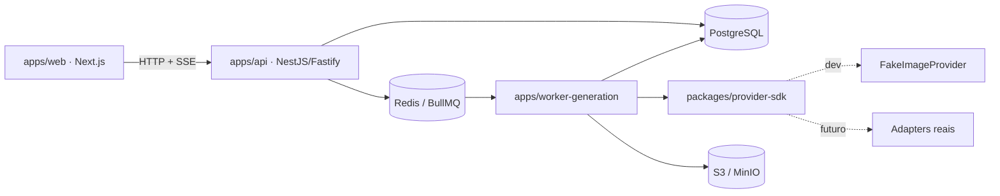
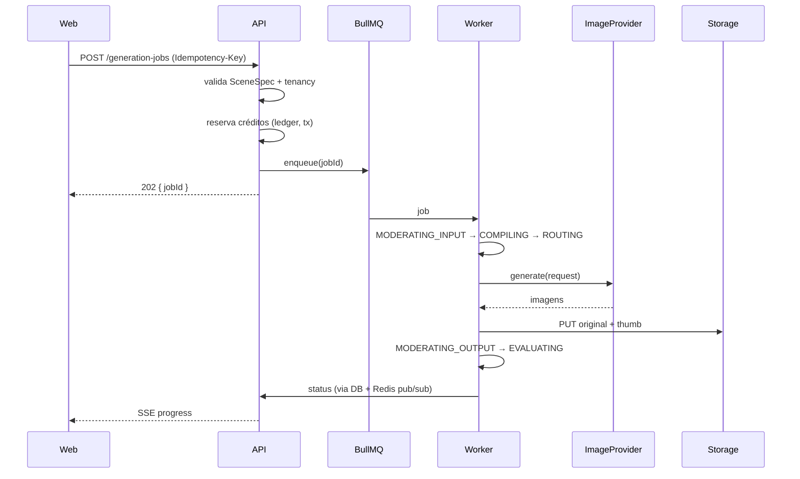

# Arquitetura

Documento vivo. Fonte original: [`arquitetura_sistema_geracao_imagens_claude_code.md`](../arquitetura_sistema_geracao_imagens_claude_code.md).
Este arquivo descreve **o que existe hoje** e **como as peças se encaixam**, não o estado final desejado.

## 1. Visão macro



Três processos, um banco, uma fila, um bucket. Nada de microserviços: os "services" do
blueprint (auth, project, asset, scene, billing, generation) são **módulos NestJS dentro de
`apps/api`**. Ver [DECISIONS.md](DECISIONS.md#d-002).

## 2. Mapa de módulos

### Apps

| App                      | Responsabilidade                                              | Estado                                                   |
| ------------------------ | ------------------------------------------------------------- | -------------------------------------------------------- |
| `apps/api`               | HTTP, autenticação, tenancy, validação, enfileiramento, SSE   | Fase 1: bootstrap, `/health`, env validado, Prisma, fila |
| `apps/worker-generation` | Consome a fila, compila prompt, chama provider, grava storage | Fase 1: worker echo com FakeImageProvider                |
| `apps/web`               | UI desktop-first do diretor criativo                          | Fase 1: shell + página de status                         |

### Packages

| Package                    | Responsabilidade                                                         | Depende de                   |
| -------------------------- | ------------------------------------------------------------------------ | ---------------------------- |
| `@waymage/scene-spec`      | Schema Zod do SceneSpec, tipos, versão, fixtures, validação de conflitos | —                            |
| `@waymage/domain`          | Contratos compartilhados api ↔ worker: nome da fila, payload, eventos    | —                            |
| `@waymage/database`        | Prisma schema, migrations e client gerado (sem build próprio, ver D-016) | —                            |
| `@waymage/storage`         | `StorageService` sobre a API S3 e convenção de chaves do bucket          | —                            |
| `@waymage/provider-sdk`    | Contrato `ImageProvider`, capabilities, `FakeImageProvider`, registry    | `scene-spec`                 |
| `@waymage/prompt-compiler` | `SceneSpec` → prompt textual por provedor (Fase 5)                       | `scene-spec`, `provider-sdk` |

Regra de dependência (unidirecional, sem ciclos):

```
scene-spec   →  (nada)
domain       →  (nada)
database     →  (nada)
storage      →  (nada)
provider-sdk →  scene-spec
prompt-compiler → scene-spec, provider-sdk
apps/*       →  todos os packages
```

`scene-spec` precisa conhecer as restrições do provedor para validar proporção, contagem e
campos profissionais — mas depender de `provider-sdk` criaria ciclo. Por isso
`ValidationContext.capabilities` declara estruturalmente só os campos necessários, e
`ProviderCapabilities` os satisfaz por tipagem estrutural, sem import.

Nenhum package importa de `apps/`. Nenhum package de domínio importa SDK de provedor real.

## 3. Fronteiras e abstrações

Existem exatamente **quatro** abstrações no sistema. Cada uma existe porque há (ou haverá em
fase próxima) mais de uma implementação real — não por gosto arquitetural.

1. **`ImageProvider`** — Fake hoje, dois provedores reais no MVP. Isola o domínio de SDKs
   externos. Obrigatório pelo blueprint (§11).
2. **`StorageAdapter`** — MinIO em dev, S3/R2 em produção. Mesma API S3, então é uma
   abstração fina sobre `@aws-sdk/client-s3`.
3. **`Queue`** — BullMQ. Uma implementação. Não há interface própria: usamos BullMQ direto.
   Ver [DECISIONS.md](DECISIONS.md#d-006).
4. **`SceneSpec` versionado** — o schema tem campo `version`; migradores entre versões só
   serão escritos quando existir uma v1.1. Ver [DECISIONS.md](DECISIONS.md#d-004).

Tudo o mais é código concreto até que uma segunda implementação apareça.

## 4. Fluxo de geração (alvo, Fase 4)



Estados do `GenerationJob` (máquina explícita, transições validadas):

```
DRAFT → QUEUED → VALIDATING → MODERATING_INPUT → COMPILING → ROUTING
      → SUBMITTING → PROCESSING → DOWNLOADING → MODERATING_OUTPUT
      → EVALUATING → COMPLETED
qualquer → FAILED | CANCELLED
```

## 5. Dados

- PostgreSQL, UUID como PK, timestamps UTC.
- `SceneSpec` gravado como `Json` (JSONB) em `scene_versions.scene_spec`.
- `workspaceId` em toda entidade multi-tenant; todo query path filtra por ele.
- Soft delete (`deletedAt`) em `Project`, `Scene`, `Asset`.
- Migrations via `prisma migrate` — nunca `db push` fora de protótipo local.

Schema completo: [`packages/database/prisma/schema.prisma`](../packages/database/prisma/schema.prisma).

## 6. Contratos compartilhados

Tipos cruzam a fronteira web↔api↔worker por **packages TypeScript**, não por duplicação.
`SceneSpec` é definido uma vez em Zod e o tipo TS é inferido (`z.infer`). O front valida com
o mesmo schema que a API — sem drift possível.

## 7. Configuração e ambiente

Todo processo valida `process.env` com Zod **no boot** e falha rápido se faltar variável
(`apps/*/src/config/env.ts`). Não há acesso a `process.env` fora desses arquivos.

## 8. Observabilidade

- Logs estruturados via Pino (embutido no Fastify; o worker instancia o seu).
- `requestId` gerado por request, propagado para `jobId` / `generationId`.
- Sentry e OpenTelemetry: variáveis já previstas no `.env.example`, instrumentação na Fase 11.

## 9. Testes

| Nível      | Ferramenta                         | Onde                          |
| ---------- | ---------------------------------- | ----------------------------- |
| Unitário   | Vitest                             | `packages/*/src/**/*.test.ts` |
| Integração | Vitest + Postgres/Redis via Docker | `apps/api/test` (Fase 2+)     |
| E2E        | Playwright                         | `apps/web/e2e` (Fase 11)      |

O foco de cobertura é o domínio crítico: SceneSpec, prompt compiler, model router, ledger,
state machine, permissões. Controllers e componentes React não carregam lógica de negócio,
logo não precisam de teste unitário próprio.

## 10. O que ainda não existe

Autenticação, RBAC, upload assinado, prompt compiler, model router, ledger, moderação,
canvas/máscaras, admin, CI. Cronograma em [ROADMAP.md](ROADMAP.md).
