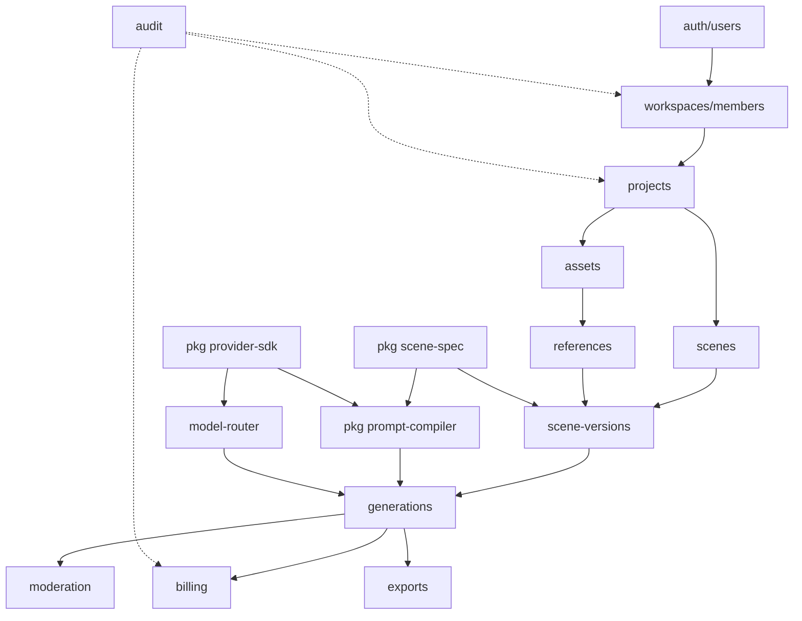

# Plano de implementação

## 1. Análise da especificação

### 1.1 Módulos identificados

Agrupados por acoplamento real, não pela lista nominal do blueprint:

| Grupo                    | Módulos                                                       | Nota                                                                                                 |
| ------------------------ | ------------------------------------------------------------- | ---------------------------------------------------------------------------------------------------- |
| **Identidade e tenancy** | `auth`, `users`, `workspaces`, `members`, `projects`          | Base de tudo. Nenhum outro módulo funciona sem `workspaceId`.                                        |
| **Cena**                 | `scenes`, `scene-versions`, `scene-spec`                      | `scene-spec` é package puro (sem I/O); os outros dois são CRUD + versionamento.                      |
| **Assets**               | `assets`, `references`, `masks`                               | Upload assinado + processamento assíncrono (thumb, análise).                                         |
| **Geração**              | `generations`, `prompt-compiler`, `providers`, `model-router` | Núcleo. `prompt-compiler` e `providers` são packages puros; `generations` é o orquestrador stateful. |
| **Dinheiro**             | `billing` (wallet + ledger)                                   | Transacional. Único lugar com requisito de serializabilidade.                                        |
| **Conformidade**         | `moderation`, `consent`, `audit`                              | Interceptam pontos do fluxo de geração e de upload.                                                  |
| **Saída**                | `exports`                                                     | Job assíncrono simples.                                                                              |
| **Operação**             | `admin`                                                       | Leitura sobre tudo + ajustes manuais de crédito.                                                     |

### 1.2 Dependências entre módulos

Caminho crítico: `auth → workspaces → projects → scenes → scene-versions → generations`.
Tudo o mais pendura nesse eixo. Por isso a ordem das fases segue esse caminho.

### 1.3 Decisões técnicas tomadas

Registradas com contexto completo em [DECISIONS.md](DECISIONS.md). Resumo:

| #     | Decisão                                                            |
| ----- | ------------------------------------------------------------------ |
| D-001 | Monorepo pnpm + Turborepo, TypeScript estrito                      |
| D-002 | Modular monolith em `apps/api` — módulos NestJS, não microserviços |
| D-003 | Packages internos compilam para CJS via `tsc`; sem bundler interno |
| D-004 | `SceneSpec` v1.0 em Zod; migradores só quando existir v1.1         |
| D-005 | Config ESLint/TS na raiz, sem packages `config-*`                  |
| D-006 | BullMQ direto, sem interface `Queue` própria                       |
| D-007 | Storage S3 (MinIO em dev), sem adapter de filesystem               |
| D-008 | Schema Prisma completo desde a Fase 1                              |
| D-009 | Sessão via JWT em cookie httpOnly (Fase 2)                         |
| D-010 | Zod nas bordas, não `class-validator`                              |

### 1.4 Riscos

| Risco                                                                          | Impacto | Probabilidade     | Mitigação                                                                                                                                                     |
| ------------------------------------------------------------------------------ | ------- | ----------------- | ------------------------------------------------------------------------------------------------------------------------------------------------------------- |
| **Custo de provedor descontrolado** — bug em retry gera cobrança real em loop  | Alto    | Média             | Idempotency key obrigatória; reserva de créditos _antes_ de submeter; teto de tentativas no BullMQ; FakeImageProvider como default até Fase 9                 |
| **Inconsistência do ledger** — saldo divergente da soma das transações         | Alto    | Média             | Ledger append-only; saldo derivado ou reconciliado; toda operação em transação Postgres; testes de concorrência                                               |
| **Vazamento cross-tenant**                                                     | Crítico | Média             | `workspaceId` obrigatório em toda entidade; guard de tenancy global na API; teste de integração que tenta acessar recurso de outro workspace em cada endpoint |
| **Drift do SceneSpec** entre front e back                                      | Médio   | Alta se duplicado | Schema único em `packages/scene-spec`, consumido pelos dois lados; campo `version` persistido                                                                 |
| **Assets privados vazando**                                                    | Alto    | Baixa             | Bucket privado, URL assinada de expiração curta, validação de MIME real (magic bytes), nunca URL pública                                                      |
| **Provedores com capabilities divergentes** — job aceito e depois inexecutável | Médio   | Alta              | `ProviderCapabilities` validado _antes_ de reservar crédito; validação de SceneSpec recebe as capabilities do provedor roteado                                |
| **Job travado** (provedor não responde)                                        | Médio   | Alta              | Timeout por estado; job stalled do BullMQ; `RELEASE` automático da reserva de créditos                                                                        |
| **Migrations destrutivas em produção**                                         | Alto    | Baixa             | Revisão obrigatória de migration no CI; nunca `prisma db push` fora de local                                                                                  |
| **Escopo do blueprint >> capacidade de entrega**                               | Alto    | Alta              | Fases pequenas com critério de aceite verificável; MVP explícito; nada de adapter real antes do fluxo ponta a ponta                                           |

### 1.5 Pontos que precisam de abstração

Abstrair só onde há segunda implementação garantida:

| Ponto                    | Abstração                             | Justificativa                                             |
| ------------------------ | ------------------------------------- | --------------------------------------------------------- |
| Geração de imagem        | `ImageProvider`                       | Fake + 2 provedores reais no MVP. Exigido pelo blueprint. |
| Armazenamento de objetos | `StorageAdapter` (fino, sobre S3 API) | MinIO local vs. S3/R2 em produção.                        |
| Moderação                | `ModerationService`                   | Regra local na Fase 8, serviço externo depois.            |
| Avaliação do resultado   | `EvaluationService`                   | Heurística simples primeiro, modelo de visão depois.      |

**Não abstrair:** fila (BullMQ é a única), ORM (Prisma é a única), cache, e-mail, logger.
Interface com uma implementação é acoplamento com passos extras.

### 1.6 Funcionalidades do MVP

Derivadas dos critérios de aceite (§34 do blueprint). Um usuário precisa conseguir, ponta a
ponta: criar conta → workspace → projeto → cena → editar SceneSpec → anexar referências com
função e peso → ver validações → ver custo estimado → gerar → acompanhar por SSE → receber 4
resultados → selecionar → variar → refinar → editar região → ver histórico → exportar → ver
consumo de créditos → excluir projeto e assets.

Fora do MVP: colaboração em tempo real, marketplace, vídeo, fine-tuning, mobile nativo,
edição vetorial, API pública.

---

## 2. Fases

Cada fase termina com: lint + typecheck + testes verdes, README atualizado, ADR quando houve
decisão relevante, e um critério de aceite demonstrável.

### Fase 1 — Fundação ✅ (esta entrega)

**Objetivo:** repositório executável de ponta a ponta, sem nenhuma dependência de API paga.

Entregas:

- Monorepo pnpm + Turborepo, TypeScript estrito, ESLint 9 + Prettier.
- `packages/scene-spec` — schema Zod v1.0 completo, tipos, fixtures, validação de conflitos, testes.
- `packages/database` — Prisma com o modelo de domínio completo + migration inicial.
- `packages/provider-sdk` — contrato `ImageProvider`, `ProviderCapabilities`, `FakeImageProvider` (latência, progresso, falha e timeout simuláveis), registry.
- `apps/api` — NestJS + Fastify, env validado por Zod, `/health` verificando Postgres/Redis/S3, filtro de erro no formato do blueprint, `requestId`.
- `apps/worker-generation` — worker BullMQ consumindo a fila com o FakeImageProvider e gravando no MinIO.
- `apps/web` — Next.js App Router + Tailwind, shell do editor e página de status do sistema.
- `infra/docker/docker-compose.yml` — Postgres, Redis, MinIO (+ criação do bucket).
- `.env.example`, README com instruções de execução, docs.

**Aceite:** `docker compose up -d` + `pnpm db:migrate` + `pnpm dev` sobe os três processos;
`GET /health` retorna `ok` para os três serviços; `pnpm check` (lint + typecheck + test) passa.

### Fase 2 — Auth e tenancy

Usuários, sessão JWT em cookie httpOnly, workspaces, membros, papéis (OWNER/ADMIN/MEMBER/VIEWER),
guard de tenancy global, projetos (CRUD + soft delete), `AuditLog` das ações de escrita.
Telas: login, registro, lista de projetos.

**Aceite:** um usuário do workspace A recebe 404 em todo recurso do workspace B (teste de
integração cobrindo cada endpoint).

### Fase 3 — Cenas, versões e autosave

CRUD de cenas, `SceneVersion` imutável, `parentVersionId`, `changeSummary`, autosave com
debounce de 800 ms e `revision` otimista, painel de propriedades do SceneSpec com validação
inline.

**Aceite:** editar a cena, recarregar a página e ver o estado preservado; gerar duas versões e
navegar entre elas.

### Fase 4 — Assets e referências

Upload em três passos (URL assinada → PUT direto → confirmação), validação de MIME real e
tamanho, worker de thumbnail, biblioteca no painel esquerdo, `ReferenceBinding` com `role`,
`weight` e `preserve`.

**Aceite:** subir um JPEG, ver a miniatura, vinculá-lo à cena como `identity` com peso 0.9 e
encontrar isso no SceneSpec persistido.

### Fase 5 — Geração ponta a ponta (FakeImageProvider)

`packages/prompt-compiler`, máquina de estados do `GenerationJob` com transições validadas,
enfileiramento com idempotency key, worker executando o pipeline completo, SSE de progresso,
grade de 4 resultados.

**Aceite:** clicar em Gerar produz 4 imagens placeholder com a barra de progresso avançando
pelos estados reais, sem nenhuma chave de API configurada.

### Fase 6 — Créditos

Wallet, ledger append-only, `estimate → reserve → capture → release → refund`, idempotência
transacional, bloqueio de saldo negativo, tela de billing.

**Aceite:** gerar com saldo insuficiente falha antes de enfileirar; job que falha por culpa do
provedor devolve a reserva; soma do ledger sempre igual ao saldo.

### Fase 7 — Resultados: seleção, variação, refinamento

Seleção de resultado, `variation`, `refine`, histórico/timeline, comparação lado a lado,
exportação.

### Fase 8 — Edição localizada

Canvas Konva, `MaskAsset`, pintar/apagar/inverter/feather máscara, `EditOperation`, before/after,
nova versão a cada edição confirmada.

### Fase 9 — Segundo provedor e roteamento

Dois adapters reais atrás da mesma interface, `ModelRouter` com o scoring do blueprint,
estimativa comparativa, fallback automático, painel de execução. **Primeiro momento em que uma
chave real é usada.**

### Fase 10 — Moderação, consentimento, auditoria e admin

Moderação de entrada e saída, `ConsentRecord` para pessoas reais, política de retenção,
trilha de auditoria completa, painel administrativo.

### Fase 11 — Hardening

Playwright ponta a ponta com o FakeImageProvider, rate limiting, CSP, acessibilidade,
performance, OpenTelemetry + Sentry, CI completo, runbook de rollback.

---

## 3. Primeiro marco funcional

O primeiro marco **funcional** (utilizável por uma pessoa real) é o fim da **Fase 5**:
login → projeto → cena → SceneSpec → referências → gerar → 4 resultados na tela, tudo com
FakeImageProvider e zero custo externo.

A Fase 1 é a fundação que torna esse marco alcançável — ela entrega infraestrutura executável,
não funcionalidade de produto.
